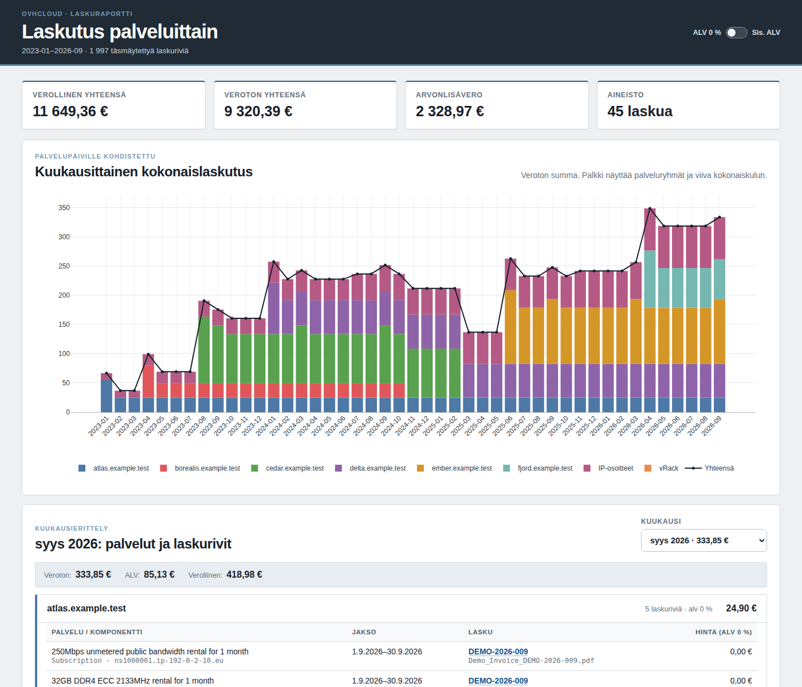
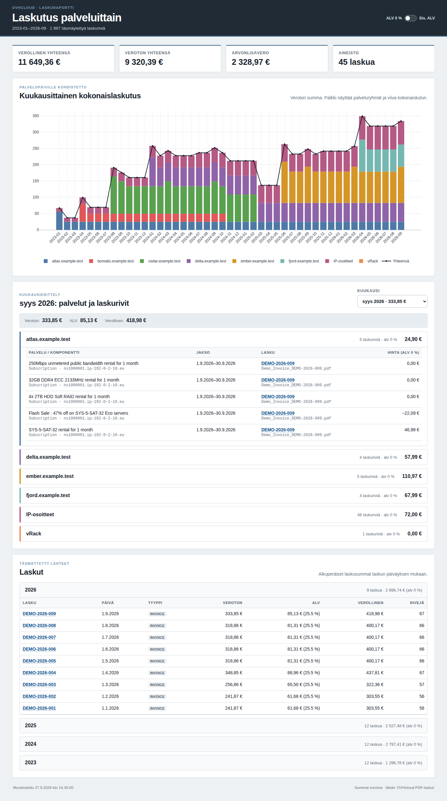

# OVHcloud-laskuraportti

OVHcloud-laskuraportti lukee hakemiston PDF-laskut, täsmäyttää niiden summat ja muodostaa kuukausittaisen palveluraportin. Raportti toimii sellaisenaan selaimessa ilman HTTP-palvelinta.

[](docs/images/ovh-report-demo-full.png)

## Toimintaperiaate

Palvelumaksut jaetaan palvelujakson päivien mukaan kalenterikuukausille. Samaan dedikoituun palvelimeen liittyvät vuokra-, laitteisto-, kaista-, asennus- ja alennusrivit esitetään yhtenä kustannusryhmänä. Palvelimet ryhmitellään pysyvällä OVH-resurssitunnuksella, ja ryhmän otsikkona näytetään viimeisin laskulta löytyvä käyttäjän antama hostname.

Verollisen ja verottoman näkymän voi vaihtaa raportin yläreunan kytkimestä. Suomen yleisen ALV-kannan muutos 24 prosentista 25,5 prosenttiin tarkistetaan 1.9.2024 alkaen. Laskusummat säilytetään aina laskulle merkityn todellisen verokannan mukaisina, ja mahdollinen poikkeama näytetään kyseisen laskun yhteydessä.

Työkalu tarkistaa jokaisesta laskusta, että laskurivien veroton summa vastaa laskun verotonta loppusummaa ja että veroton summa sekä ALV vastaavat verollista loppusummaa. Tunnistamaton laskurakenne tai täsmäytysvirhe keskeyttää ajon ja ilmoittaa laskun sekä mahdollisuuksien mukaan sivun ja virheellisen kohdan.

## Syöte ja tuloste

Oletuksena työkalu etsii rekursiivisesti kaikki PDF-tiedostot `input/`-hakemistosta ja kirjoittaa raportin `output/`-hakemistoon. PDF:n nimellä tai alihakemiston nimellä ei ole merkitystä, sillä laskutunnus ja muut tiedot luetaan PDF:n sisällöstä.

Tuloste sisältää:

- `output/index.html`: selaimessa avattava raportti
- `output/report.json`: sama raporttiaineisto koneluettavassa muodossa
- `output/pdfs/VUOSI/LASKUNUMERO.pdf`: raporttiin linkitetyt lähdelaskut

Raportti ja siihen kopioidut laskut toimivat kokonaan paikallisesti. Laskuja tai niiden tietoja ei lähetetä verkkoon.

Jos sama laskunumero löytyy useasti täysin samalla parsitulla sisällöllä, ensimmäinen säilytetään ja muista tulostetaan varoitus. Jos saman laskunumeron sisältö poikkeaa, ajo keskeytetään ja erot ilmoitetaan.

Työkalu ei käytä tietokantaa tai aiemman ajon tilaa. Jokainen ajo lukee kaikki PDF:t ja rakentaa raportin uudelleen. Vanha `output` korvataan vasta, kun kaikki laskut on parsittu ja validoitu onnistuneesti.

## Asennus ja käyttö

Työkalu vaatii Python 3.11:n tai uudemman. Ensimmäinen asennus tarvitsee verkkoyhteyden Pythonin ja riippuvuuksien lataamiseen.

### Windows (suositeltu tapa: uv)

Suorita seuraavat komennot PowerShellissä projektihakemistossa.

1. Asenna `uv` Windowsin paketinhallinnalla:

   ```powershell
   winget install --id=astral-sh.uv -e
   ```

   Sulje PowerShell asennuksen jälkeen, avaa se uudelleen ja varmista asennus:

   ```powershell
   uv --version
   ```

2. Asenna projektin riippuvuudet. `uv` hankkii tarvittaessa myös sopivan Python-version:

   ```powershell
   uv sync
   ```

3. Lisää laskut `input`-hakemistoon ja muodosta raportti:

   ```powershell
   uv run ovh-report
   ```

4. Avaa valmis raportti:

   ```powershell
   Start-Process .\output\index.html
   ```

Kun laskuja lisätään tai poistetaan, raportin voi rakentaa uudelleen komennolla `uv run ovh-report`.

#### Windows ilman uv:ta

Jos koneessa on jo Python 3.11 tai uudempi, voit käyttää Pythonin omaa virtuaaliympäristöä. Virtuaaliympäristöä ei tarvitse aktivoida, koska komennot kutsuvat sen ohjelmia suoraan.

PowerShell:

```powershell
py --version
py -m venv .venv
.\.venv\Scripts\python.exe -m pip install -e .
.\.venv\Scripts\ovh-report.exe
Start-Process .\output\index.html
```

Komentokehote (`cmd.exe`):

```bat
py --version
py -m venv .venv
.venv\Scripts\python.exe -m pip install -e .
.venv\Scripts\ovh-report.exe
start "" output\index.html
```

Varmista `py --version` -tulosteesta, että käytössä on vähintään Python 3.11. Jos `py`-komentoa tai sopivaa Pythonia ei löydy, asenna vähintään Python 3.11 tai käytä `uv`-tapaa. Jos juuri asennettua `uv`-komentoa ei löydy, avaa uusi PowerShell-ikkuna, jotta päivittynyt `PATH` tulee käyttöön.

### Linux ja macOS (uv)

```bash
uv sync
uv run ovh-report
```

### Linux ja macOS (venv)

```bash
python3.11 -m venv .venv
.venv/bin/python -m pip install -e .
.venv/bin/ovh-report
```

Syöte- ja tuloshakemistot voi antaa erikseen:

```bash
uv run ovh-report MUU_INPUT --output MUU_OUTPUT
```

Syöte ja tuloste eivät saa sijaita sisäkkäin.

## Tarkistukset

```bash
uv sync --extra test
uv run pytest
```

Testit käsittelevät myös tämän hakemiston koko PDF-aineiston, jos laskut ovat saatavilla.

## Lisenssi

Tämä projekti on julkaistu [CC0 1.0 Universal](LICENSE) -ehtojen mukaisesti.

## Koko esimerkkiraportti

[](docs/images/ovh-report-demo-full.png)

## Toteutus

Tämä projekti on tehty täysin tekoälyllä: OpenAI Codex CLI + GPT-5.6-sol-medium.
